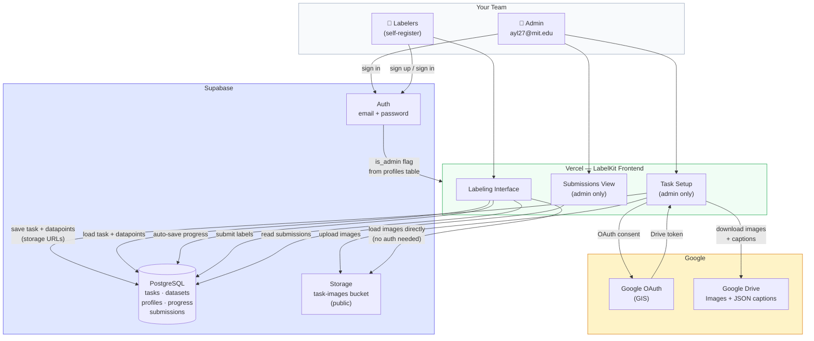

# LabelKit

A web app for labeling image-caption pairs from Telegram channels. Admins create tasks and upload data from Google Drive; labelers work through tasks in a browser with progress auto-saved to the cloud.

## System Diagram



## Stack

| Layer | Technology |
|---|---|
| Frontend | React 18 + TypeScript + Vite |
| Styling | Tailwind CSS |
| State | Zustand (with localStorage persistence) |
| Auth + Database | Supabase (PostgreSQL + Row-Level Security) |
| File Storage | Supabase Storage (public bucket) |
| Image/Caption Source | Google Drive API + Google OAuth (GIS) |
| Hosting | Vercel |

## Repo Structure

```
/
├── app/                        # Vite + React frontend
│   ├── src/
│   │   ├── components/         # DriveLoader, AuthenticatedImage, QuestionField
│   │   ├── lib/                # db.ts, driveApi.ts, supabase.ts
│   │   ├── pages/              # Home, TaskSetup, Labeling, DetailView, TableView, Results
│   │   ├── store/              # Zustand store (auth, tasks, session, labels)
│   │   └── types/              # Shared TypeScript types
│   ├── supabase-schema.sql     # Full DB + storage schema — safe to re-run
│   └── .env.example            # Required environment variables
├── prepare_data.py             # Prepares a JSON datapoints file from local images
└── collect_images_and_captions.ipynb  # Notebook for pulling data from Telegram
```

## Setup

### 1. Supabase

1. Create a project at [supabase.com](https://supabase.com)
2. Go to **SQL Editor** and run the full contents of `app/supabase-schema.sql`
   - Creates all tables, RLS policies, auth trigger, and the `task-images` storage bucket
   - Safe to re-run at any time
3. Copy your **Project URL** and **anon public key** from Settings → API

### 2. Google OAuth (for admin data loading)

1. Go to [console.cloud.google.com](https://console.cloud.google.com)
2. Create a project → enable the **Google Drive API**
3. Credentials → Create → **OAuth 2.0 Client ID** → Web application
4. Add your deployed URL (and `http://localhost:5174` for local dev) to **Authorized JavaScript origins**
5. Copy the Client ID

### 3. Environment Variables

Create `app/.env` from the example:

```bash
cp app/.env.example app/.env
```

Fill in:

```env
VITE_SUPABASE_URL=https://xxxx.supabase.co
VITE_SUPABASE_ANON_KEY=eyJ...
VITE_GOOGLE_CLIENT_ID=123456789-abc….apps.googleusercontent.com
```

### 4. Run Locally

```bash
cd app
npm install
npm run dev
# → http://localhost:5174
```

### 5. Deploy to Vercel

```bash
npm install -g vercel
cd app
vercel
```

Set the same three environment variables in your Vercel project settings (Settings → Environment Variables), then redeploy.

## How It Works

### Admin (task creation)

1. Sign in with `ayl27@mit.edu` — automatically granted admin access
2. Click **+ New Task**, name it, select label questions from the preset library
3. In the Dataset section, click **Sign in & Load Data** — authenticates with Google and pulls images + captions from Drive
4. Images are downloaded from Drive and uploaded to Supabase Storage during this step (takes a few minutes for large datasets)
5. Click **Save Task** — task and datapoints (with permanent storage URLs) are saved to the database

### Labelers

1. Sign up with any email at the deployed URL
2. Select a task from the home screen → click **Start**
3. Label each image-caption pair using the question panel on the right
4. Progress is auto-saved after every label change — resumable at any time
5. Click **Submit** when done to record a final submission

### Data Preparation (optional)

If your images are stored locally rather than in Google Drive, use `prepare_data.py` to generate a JSON file and upload it via the **Upload JSON** tab in task creation:

```bash
pip install -r requirements.txt
python prepare_data.py --images ./images --output data.json
```

## Label Schema

Each task has a configurable set of questions drawn from a preset library. Default categories:

`exclusion` · `stance` · `framing` · `tactics` · `in_out_group` · `image_type` · `text_in_image` · `caption` · `subjects` · `setting` · `cta` · `symbols` · `notes`

Custom questions (single choice, multi-select, or free text) can be added per task.

## Exporting Results

- **In-browser**: click **Export JSON** during a labeling session to download your labels locally
- **Admin view**: the Submissions page shows all submitted labels across all labelers
- **Supabase**: query the `submissions` table directly for bulk export
